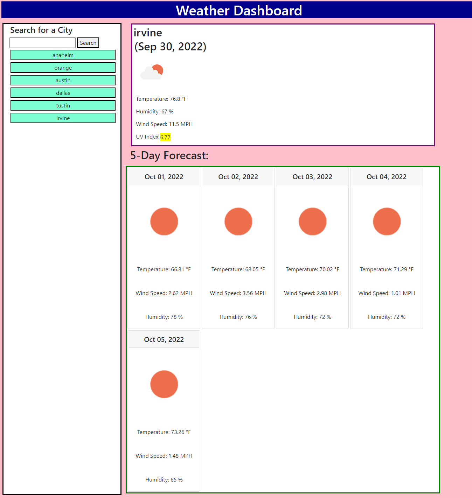

# weather-dashboard

## Description
This homework assignment is using the OpenWeather One Call API to retrieve weather data for different cities. Through this project, data from another application's API is being retrieved in order to formulate a webpage with our own context. In order for a user to use this site, the user simply has to input the city name in the search bar on the left side of the webpage. Once the user clicks the "Search" button or hitting "Enter" on the keyboard, due to the use of the weather API, the webpage will then show the temperature, humidity, wind speed, and UV index of the city chosen. In addition, there will be a 5 day forecast that appears on the bottom, which will show the temperature, wind speed, and humidity for the next five days for the chosen city. If the user wants to choose a different city, the user can simply type in a different city in the search bar and the new city's temperature will appear. The searched cities will save as a button on the left column, so that the user can easily click on the previous searched city if desired. 

## Website Screenshot

## Link to Site
[Link](https://lydiakim10.github.io/weather-dashboard/)